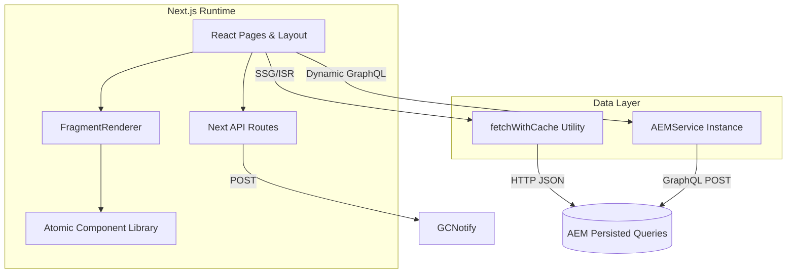
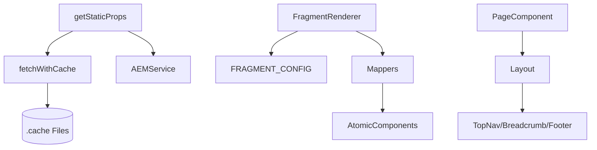

# Project Architecture Blueprint

_Last generated: 2026-01-07_

## 1. Architecture Detection and Analysis
- **Frameworks & Libraries**: Next.js 14.2, React 18, Apollo Client, Tailwind CSS, next-i18next, Joi, Cypress, Jest, Storybook, GCNotify REST APIs; confirmed via [package.json](package.json).
- **Organizational Patterns**: Atomic design for UI ([components/](components)), Next.js file-system routing ([pages/](pages)), dedicated service abstraction for AEM ([services/AEMService.js](services/AEMService.js)), utility layer ([lib/utils](lib/utils)).
- **Build & Deployment**: Yarn scripts power dev/test/build/Docker flows ([package.json](package.json)), Next.js standalone output plus strict CSP and locale rewrites ([next.config.js](next.config.js)).
- **Configuration Sources**: Environment variables for AEM endpoints, GCNotify templates, ISR toggles, Adobe Analytics, Report-A-Problem gating; surfaced in README and consumed across services.

## 2. Architectural Overview
- **Guiding Principles**: Static-first rendering with ISR, CMS-driven content, bilingual accessibility, strict security posture, and reusable atomic components.
- **Primary Boundaries**:
  - **Presentation Shell**: Layout, navigation, and design tokens (Tailwind) kept within components/atoms|molecules|organisms.
  - **Content Orchestration**: Fragment renderer decouples AEM data structures from UI components.
  - **Data Access**: AEM fetch layer (`fetchWithCache`, `AEMService`) isolates remote calls and caching.
  - **Experience APIs**: Next.js API routes encapsulate Notify integrations.
- **Hybrid Patterns**: Mix of SSG/ISR for marketing content plus client interactivity (filters, forms) and limited serverless functions for submissions.

## 3. Architecture Visualization
### 3.1 C4 Level 1 – System Context
```mermaid
graph TD
  CitizenBrowser[Citizen Browser] -->|HTTPS| NextApp[Service Canada Labs (Next.js)]
  NextApp -->|GraphQL over HTTPS| AEM[(Adobe Experience Manager GraphQL)]
  NextApp -->|REST JSON| GCNotify[(GCNotify Email API)]
  AdobeAnalytics[(Adobe Analytics Tag Manager)] -.-> NextApp
```

### 3.2 C4 Level 2 – Container View


### 3.3 C4 Level 3 – Component View (Content Page Example)


## 4. Core Architectural Components
| Component | Purpose & Responsibility | Internal Structure | Interaction Patterns | Evolution Notes |
|-----------|-------------------------|--------------------|----------------------|-----------------|
| **Layout Shell** ([components/organisms/Layout.js](components/organisms/Layout.js)) | Provides consistent chrome (GC banner, nav, breadcrumb, feedback hooks, footer). | Composes atoms/molecules (Banner, PhaseBanner, TopNavBar, Feedback, Footer). | Receives props from pages for locale, breadcrumbs, toggles; wraps children; passes i18n via `useTranslation`. | Extend via optional props (pre-footer CTA, survey popup). Keep new sections optional to avoid breaking existing pages.
| **Fragment Rendering System** ([components/fragment_renderer/FragmentRender.js](components/fragment_renderer/FragmentRender.js)) | Maps AEM fragments to React components with strict validation. | `FRAGMENT_CONFIG` defines component+mapper pairs; mappers reside in [components/fragment_renderer/mappers](components/fragment_renderer/mappers); validation helpers ensure required fields. | Pages pass `projectData.scFragments` plus locale; renderer selects mapper, transforms content, returns atomic components. | Adding a fragment requires updating config, mapper, tests, and dictionary entries; pattern supports plugin-like growth.
| **AEM Data Access** ([services/AEMService.js](services/AEMService.js), [lib/utils/aemCache.js](lib/utils/aemCache.js)) | Encapsulates GraphQL POSTs/persisted query loading and optional local caching. | Dynamic import of `.graphql` files, fetch with custom headers, conditional filesystem caching during development. | Pages call `fetchWithCache` for REST JSON endpoints and `aemServiceInstance.getFragment` for dictionary fragments. | Extend by adding new persisted queries; maintain caching semantics and ensure `.cache` has TTL logic if needed.
| **Feedback & Problem Reporting** ([components/organisms/Feedback.js](components/organisms/Feedback.js), [components/organisms/ReportAProblem.js](components/organisms/ReportAProblem.js)) | Capture quick satisfaction signal and detailed issue reports. | Local React state for form flow, sanitized inputs via `stripFeedback` util. | POST to `/api/submit-feedback` and `/api/report-a-problem`; server routes call GCNotify helpers. | Additional channels can reuse GCNotify helper patterns; keep PII scrubbing up to date.
| **API Routes / Notify Integration** ([pages/api/submit-feedback.js](pages/api/submit-feedback.js), [pages/api/report-a-problem.js](pages/api/report-a-problem.js)) | Serverless endpoints bridging front-end forms with GCNotify. | Input guards, conditional feature flag (`REPORT_A_PROBLEM_ENABLED`), templated defaults, error logging. | Use `postFeedbackToGcNotify`/`submitEmail` helpers for REST calls; responses normalized to 200/400/500. | Common validator middleware can be introduced for consistency; consider rate limiting if traffic grows.
| **Routing & Page Modules** (e.g., [pages/home.js](pages/home.js), [pages/projects/[projectId]/index.js](pages/projects/%5BprojectId%5D/index.js)) | Orchestrate data fetching (SSG/ISR), localization, analytics hooks, and composition of organisms. | `getStaticProps`, `getStaticPaths`, dictionary lookups, filtering utilities. | Compose Layout, FragmentRenderer, Explore* organisms; rely on libs for sorting/filtering. | Keep data selection minimal to reduce payload; new pages should mirror caching and dictionary usage.

## 5. Architectural Layers and Dependencies
1. **Presentation Layer**: React components (atoms→molecules→organisms), Layout, fragment/view components.
2. **Composition Layer**: Next.js pages controlling data assembly, translations, SEO meta, analytics.
3. **Content Mapping Layer**: Fragment renderer, text-node renderer, dictionary utilities.
4. **Data Access Layer**: `fetchWithCache`, `AEMService`, Apollo client wrappers, GraphQL persisted queries.
5. **Integration Layer**: API routes + Notify utilities.
6. **Infrastructure Layer**: Next.js runtime, rewrites, security headers, Tailwind theme, fonts.

Dependency direction flows downward only; presentation never imports services directly (pages mediate). No circular dependencies observed. GraphQL queries load via webpack rule defined in [next.config.js](next.config.js) ensuring `.graphql` imports stay isolated.

## 6. Data Architecture
- **Domain Model**: CMS-centric entities (Pages, Projects, Updates, Dictionary terms) delivered as nested JSON with bilingual fields (`scTitleEn`, `scTitleFr`, etc.).
- **Data Fetching**: REST JSON endpoints (e.g., `getSclAllProjectsV2`) fetched via `fetchWithCache`; GraphQL persisted queries loaded through `AEMService`. Apollo client config in [graphql/client.js](graphql/client.js) provides an alternative query path.
- **Caching Strategy**: Local filesystem caching for development in both fetch utilities reduces CMS load; production relies on ISR revalidation (env-driven) to refresh static pages.
- **Transformation**: Mapper functions normalize AEM fragment payloads into props; `TextRender` handles rich-text JSON trees.
- **Validation**: `fragmentValidators` in [components/fragment_renderer/utils/validation.js](components/fragment_renderer/utils/validation.js) enforce required paths; Joi middleware ([middlewares/joi.js](middlewares/joi.js)) is available for API schemas, though current handlers do manual checks.
- **Data Privacy**: `stripFeedback` removes postal codes, SINs, emails, phone numbers before submissions.

## 7. Cross-Cutting Concerns Implementation
- **Authentication & Authorization**: Not required—content is public. Future protected routes should hook into Next.js middleware and adopt GC SSO standards.
- **Error Handling & Resilience**:
  - Fragment renderer fails gracefully when config missing (console warning).
  - API routes wrap Notify calls in try/catch with 500 fallback.
  - `fetchWithCache` retries via exception propagation, logging, and avoids crashing builds.
- **Logging & Monitoring**: Serverless functions log errors to stdout (surfaced in platform logs). Adobe Analytics scripts optionally injected via `_document` and tracked in pages.
- **Validation**: Radio inputs enforce required fields, `stripFeedback` cleans PII, Joi middleware ready for reuse.
- **Configuration Management**: `.env` controls endpoints, toggles, template IDs; Next.js rewrites & headers derived from env. Secrets used server-side only (Notify keys, AEM endpoints).

## 8. Service Communication Patterns
- **Service Boundaries**: Front-end ↔ AEM CMS for content; Front-end ↔ GCNotify for outbound email.
- **Protocols**: HTTPS JSON/GraphQL, REST for Notify; static assets served via Next.js.
- **Sync vs Async**: All calls synchronous per request; ISR handles periodic regeneration. No message queues.
- **Versioning**: Persisted queries encode version suffixes (e.g., `getSclAllProjectsV2`). API routes internally versioned by filename; external clients unaffected.
- **Discovery**: AEM endpoints configured via env; GCNotify base URL configurable for dev/prod.
- **Resilience**: Dev caching plus ISR reduce load on upstream CMS; API handlers degrade gracefully with generic error message.

## 9. Technology-Specific Architectural Patterns
### React/Next.js Patterns
- Component composition via Atomic design ensures reusability and documentation (Storybook stories & PropTypes per component).
- `Layout` wraps all pages, ensuring accessibility (skip links, breadcrumbs) and bilingual toggles.
- State kept local for UI controls (filters, forms); no global state manager required.
- Routing uses file-based convention with rewrites for `/fr` equivalents ([next.config.js](next.config.js)).
- Data fetching uses `getStaticProps`/`getStaticPaths` extensively with ISR toggles.
- Side-effects handled via `useEffect` for analytics initialization and query-string filters.

### Tailwind CSS Patterns
- Custom design tokens defined in [tailwind.config.js](tailwind.config.js) using GC color palette, font variables from `_app`. Utility-first classes dominate; safelist ensures dynamic classes survive purge.

### Internationalization Patterns
- `appWithTranslation` wraps `_app`; `next-i18next.config.js` disables auto-detection to rely on rewrites.
- Dictionary fragments loaded at build time for labels; `getDictionaryTerm` centralizes lookups.
- Bilingual fields follow `sc*En`/`sc*Fr` naming, enabling deterministic selection per locale.

## 10. Implementation Patterns
- **Interface Design**: Components expose narrow props; Layout uses optional props to avoid breaking additions. Fragment mappers hide raw CMS shape.
- **Service Implementation**: `AEMService` handles GraphQL request creation, caching, and error states; GCNotify helpers accept payload + defaults + endpoint parameters to maximize reuse.
- **Repository/Query Patterns**: Persisted query modules (in `graphql/queries`) referenced by filename, guaranteeing compile-time linkage via webpack loader.
- **Controller/API Patterns**: Each API handler checks method, validates required fields, and responds with standard HTTP codes; future handlers should wrap with Joi validator for uniform error bodies.
- **Domain Model Enforcement**: Utilities such as `filterItems`, `sortUpdatesByDate`, `getAllPathParams` encapsulate domain-specific transformations (filtering self references, ordering by date, generating bilingual paths).

## 11. Testing Architecture
- **Unit Testing**: Jest with jsdom environment ([jest.config.js](jest.config.js)); coverage spans components/lib/pages/middlewares. `setupTests.js` configures React Testing Library, mocks router/link, sets up i18n.
- **Accessibility Testing**: `jest-axe` integrated into component tests; Cypress uses `cypress-axe`.
- **Storybook-Driven Tests**: Components often tested via their Storybook stories to ensure parity.
- **E2E Testing**: Cypress config ([cypress.config.js](cypress.config.js)) retains legacy plugins; baseUrl `http://localhost:3000`.
- **Test Data**: `__mocks__` directory holds fixtures for GraphQL responses and media.

## 12. Deployment Architecture
- **Build**: `yarn build` generates Next.js standalone output; Node 18.19 is required runtime.
- **Docker**: `yarn docker:build` injects required AEM/Notify args; `docker:run` exposes port 3000.
- **Security**: Strict CSP, HSTS, frame denial, permissions-policy set globally ([next.config.js](next.config.js)). Robots route restricts crawlers differently by environment ([pages/api/robots.js](pages/api/robots.js)).
- **Runtime Config**: ISR optional via `ISR_ENABLED`; `ADOBE_ANALYTICS_URL` triggers script injection in `_document`.
- **Monitoring**: Healthcheck route ([pages/api/healthcheck.js](pages/api/healthcheck.js)) returns static OK (TODO indicates future CMS checks).

## 13. Extension and Evolution Patterns
- **Feature Addition**:
  - **Content-driven feature**: create persisted query, mapper, component; update FR config and dictionary.
  - **New page**: create file under `pages/`, fetch data via `fetchWithCache`, wrap with Layout, register rewrites if FR alias needed, add translations under `public/locales`.
- **Modification**:
  - Maintain backward compatibility by keeping bilingual fields and dictionary IDs stable.
  - When altering fragments, version the mapper/config to avoid breaking stored content.
  - Use ISR + revalidation to roll out incremental data changes safely.
- **Integration**:
  - External APIs should be consumed via dedicated helper modules akin to GCNotify utilities; sanitize and validate inputs; consider anti-corruption layers before injecting third-party data into components.

## 14. Architectural Pattern Examples
### Fragment Mapping & Layer Separation
```javascript
// components/fragment_renderer/FragmentRender.js
export default function FragmentRender({ fragments, locale, excludeH1 }) {
  return fragments.map((fragmentData) => {
    const config = FRAGMENT_CONFIG[fragmentData?._model.title];
    if (!config) {
      console.warn(`No configuration found for fragment type: ${fragmentData?._model.title}`);
      return null;
    }
    const { component: Fragment, mapper } = config;
    const props = mapper(fragmentData, locale, excludeH1);
    return <Fragment key={uuid()} {...props} />;
  });
}
```
This shows how presentation depends only on mapper output, keeping AEM schema isolated.

### SSG Data Composition
```javascript
// pages/projects/[projectId]/index.js
export const getStaticProps = async ({ locale, params }) => {
  const { data: allProjectsData } = await fetchWithCache(`${process.env.AEM_BASE_URL}/getSclAllProjectsV2${process.env.AEM_CONTENT_FOLDER}`);
  const pages = allProjectsData.sclabsPageV1List.items;
  const pageData = pages.filter((page) => (
    (locale === "en" ? page.scPageNameEn : page.scPageNameFr).split("/").at(-1) === params.projectId
  ));
  if (!pageData.length) return { notFound: true };
  // ...prepare related data & translations
  return { props: { projectData: pageData[0], /* ... */ }, revalidate: process.env.ISR_ENABLED === "true" ? 600 : false };
};
```
Demonstrates domain filtering, bilingual path resolution, ISR toggling.

### Service Integration Pattern
```javascript
// pages/api/submit-feedback.js
export default async function handler(req, res) {
  const data = req.body;
  if (!data["what-was-wrong"]) {
    res.status(400).json({ message: "required field missing" });
    return;
  }
  try {
    const notifyResponse = await postFeedbackToGcNotify(data);
    if (notifyResponse.ok) {
      res.status(200).json(data);
    } else {
      console.error(await notifyResponse.json());
      throw new Error("Notify failed");
    }
  } catch (error) {
    console.error("Failed to post to GC Notify", error);
    res.status(500).json({ message: "something went wrong" });
  }
}
```
Encapsulates validation, downstream call, and standardized error handling.

## 15. Architecture Governance
- **Automated Checks**: `yarn lint`, `yarn lint:test`, Jest suites, Cypress runs, OWASP ZAP baseline/full scans (`security:*` scripts).
- **Documentation**: README plus Storybook stories for components; this blueprint should live alongside `.github/copilot-instructions.md` for discoverability.
- **Process**: Code reviews should verify bilingual coverage, accessibility, and fragment contract adherence; tests must include jest-axe checks for new UI.

## 16. Blueprint for New Development
- **Workflow**:
  1. Define CMS contract (AEM fragment/query) and translation dictionary entries.
  2. Build mapper + component + story/test.
  3. Wire page-level data fetching via `fetchWithCache`/`getStaticProps`.
  4. Integrate analytics hooks and dictionary lookups.
  5. Add translations and update Tailwind tokens if new styles required.
  6. Run lint, unit, accessibility, and Cypress tests; document feature in README/CHANGELOG.
- **Implementation Templates**: Reuse `FragmentRender` pattern for content-driven sections; base API handlers on existing Notify routes; new utilities belong under `lib/utils` with co-located tests.
- **Common Pitfalls**:
  - Forgetting bilingual rewrites or dictionary entries results in 404s/missing text.
  - Bypassing fragment validators can break runtime; always update `FRAGMENT_CONFIG` and tests together.
  - Omitting `stripFeedback` or equivalent sanitation risks PII leakage.
  - Over-fetching data in `getStaticProps` increases ISR latency—filter fields before returning props.
- **Keeping This Blueprint Current**: Revisit whenever major dependencies change (Next.js upgrade, CMS contract updates, new integrations). Recommend aligning updates with release milestones and automated architectural linting (e.g., scripts that verify fragment registrations).
